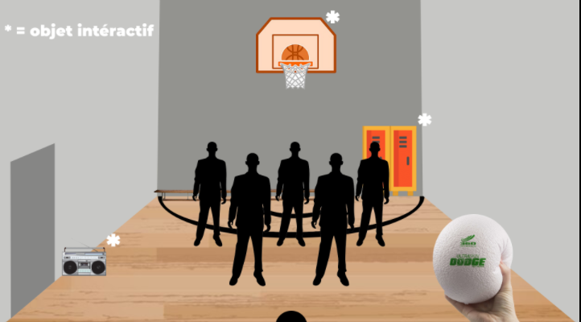
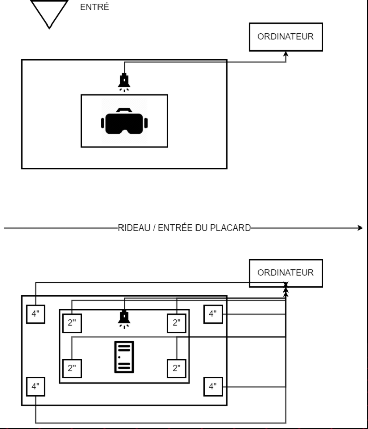

# Titre : 
## 3 minutes

# Les créateurs et créatrices : 
## Naoufal Bensaiad, Jérémie Lévesque et Samuel Poulin.

# La façon dont le thème du temps est exploité dans la création :
## Nous avons deux points de vue, celui d'un enfant qui joue au ballon dans un gymnase avec une musique entrainante et celui d'un enfant qui est enfermé dans un casier. Ils essaient de démontrer que le temps semble plus long lorsque l'on est triste que lorsque nous avons du plaisir.

# L'ambiance : 
## Pour la partie où l'enfant joue au ballon c'est une ambiance dynamique et joyeuse alors que lorsque l'enfant est dans le casier c'est une ambiance triste.

# L'installation en cours dans les studios :

## Il y aura un casque VR dans un petit casier et les joueurs seront à l'intérieur de celui-ci pour une partie de l'expérience. L'autre partie se déroulera à l'extérieur du casier.

# Le schéma de l'installation prévue :

Source Github 3 minutes: https://tim-montmorency.com/2022/projets/3-minutes/docs/web/index.html

# Ce qui sera attendu de nous, en tant qu'interacteur.trice, lorsque vous ferez l'expérience de l'installation :

## Nous serons dans un gymnase pour la première de l'expérience. Nous allons pouvoir lancer des ballons sur des éléments qui feront des bruits si nous les touchons avec les ballons. Par exemple, il y un casier dans le coin du gymnase et si un ballon cogne le casier nous pouvons entendre un enfant pleurer. L'autre partie de l'expérience se déroule dans le casier. Nous serons dans la peau de l'enfant qui pleure et nous entendrons les autres enfants jouer aux ballons chasseur dans le gymnase. Nous pourrons entendre une musique triste et déplaisante dans le casier.  

# 3 cours du programme qui nous semblent incontournables pour avoir les compétences pour créer ce projet :
## Réalité virtuelle pour créer l'expérience VR.
## Conception sonore pour créer les sons de casiers et la musique entrainante.
## Modélisation 3D pour modéliser le décor du casier et du gymnase
