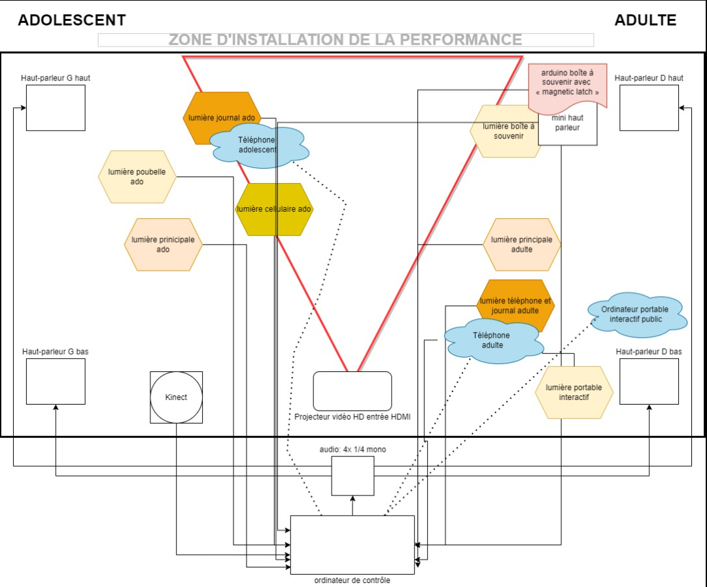

# Titre : 
## Chère Sasha

# Les créateurs et créatrices : 
## Les créateurs et créatrices sont: Trish Nguyen, Angelina De Silva Jeca, Karine Cormier et abrina Kayani

# La façon dont le thème du temps est exploité dans la création :
## Le temps est utilisé en montrant la vie d'une personne LGBTQ avec les différents passages de sa vie.

# L'ambiance :
## une ambiance dépressive est à la fois heureuse dépendamment du coté de la chambre d'une personne LGBTQ. Nous allons voir comment les croyances de son entourage vont changer la vie de cette personne. D'un côté, une chambre d'adolescente sale et dépressive avec elle qui pleure. De l'autre, une chambre propre et remplit de joie de vivre et colorée pour montrer qu'elle est mieux maintenant avec des rires qu'on entend.

# L'installation en cours dans les studios :
## Le logiciel Max va contrôler l'installation avec des haut-parleurs, une kinect accrocher au plafond. De plus, il y a un projecteur pour afficher les messages.

# Le schéma de l'installation prévue :

Source Github Chère Sasha: https://tim-montmorency.com/2022/projets/Chere-Sasha/docs/web/index.html

# Ce qui sera attendu de vous, en tant qu'interacteur.trice, lorsque vous ferez l'expérience de l'installation :

## il y aura des objets narratifs et interactifs comme des journaux et la poubelle que l'on pourra observer et la boîte a souvenir et le cellulaire pour participer à l'histoire. Nous pourrons aussi laisser notre trace en écrivant des messages qui seront projetés sur le mur.

# 3 cours du programme qui vous semblent incontournables pour avoir les compétences pour créer ce projet :
## Conception de projet multimédia pour la conception du projet.
## Espace interactif pour créer les espaces interactifs comme le téléphone.
## Gestion de projets multimédias pour toute la gestion.
