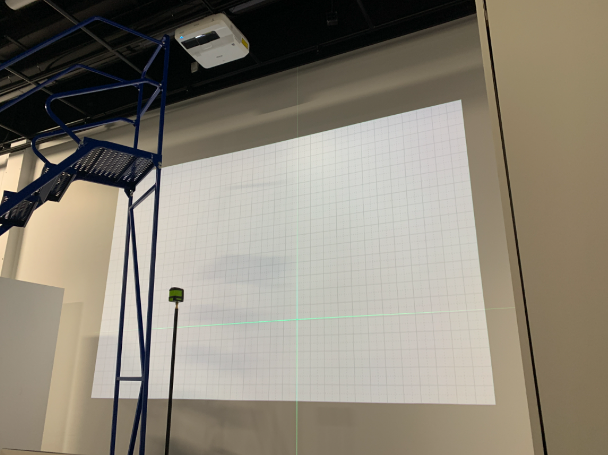
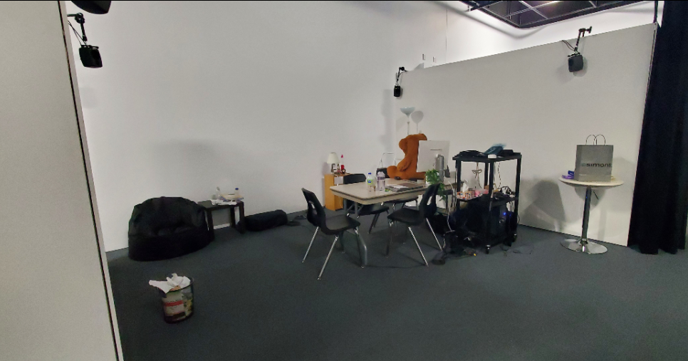

# Titre : 
Chère Sasha

# Les créateurs et créatrices : 
Les créateurs et créatrices sont: Trish Nguyen, Angelina De Silva Jeca, Karine Cormier et abrina Kayani

# La façon dont le thème du temps est exploité dans la création :
Le temps est utilisé en montrant la vie d'une personne LGBTQ avec les différents passages de sa vie.

# L'ambiance :
une ambiance dépressive et à la fois heureuse dépendamment du coté de la chambre d'une personne LGBTQ. Nous allons voir comment les croyance de son entourage va changer la vie de
cette personne. D'un coté, une chambre d'adolescant sale et dépressive avec elle qui pleur de l'autre,

# L'installation en cours dans les studios :

# Le schéma de l'installation prévue :

# Ce qui sera attendu de vous, en tant qu'interacteur.trice, lorsque vous ferez l'expérience de l'installation :

# 3 cours du programme qui vous semblent incontournables pour avoir les compétences pour créer ce projet :
