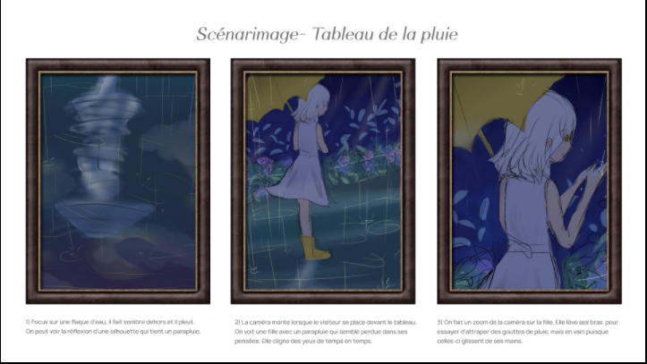
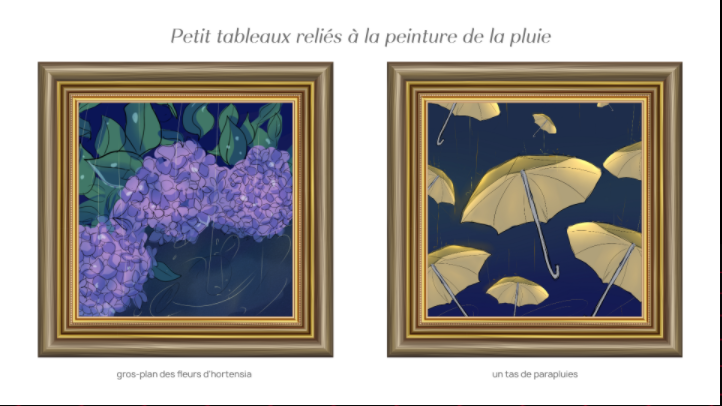
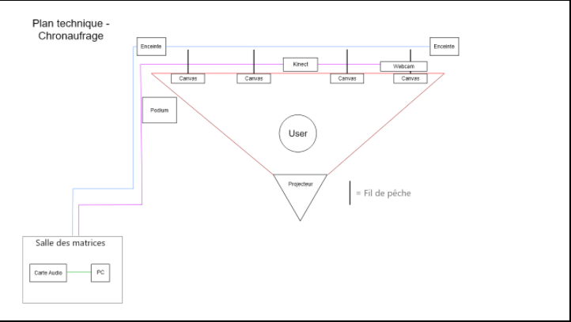

# Titre : 
## Chronaufrage

# Les créateurs et créatrices : 
## Maloney Khim, Sounthida Kong, Olivier Lalonde, Rebecca Pilotte et Émilie Fontaine

# La façon dont le thème du temps est exploité dans la création :
## Le thème du temps est exploité à travers l'eau. Plus nous nous approchons de l'oeuvre et plus l'eau s'agite et plus nous nous éloignons et plus l'eau se calme.

# L'ambiance :
## L'ambiance est relaxante et appaisante.

# L'installation en cours dans les studios :
## 4 Grands tableaux s'anime selon la position ou les gestes de l'intéracteur.

# Le schéma de l'installation prévue :

Source Github Chronaufrage: https://tim-montmorency.com/2022/projets/Chronaufrage/docs/web/index.html

# Ce qui sera attendu de vous, en tant qu'interacteur.trice, lorsque vous ferez l'expérience de l'installation :
## Nous allons pouvoir intéragir avec des tableaux durant l'expérience. Chaque fois que nous allons nous approcher d'un tableau, l'eau dans celui-ci va s'agiter. Il y a 4 tableaux à notre disposition, chacun ayant de l'eau à l'intérieur de ceux-ci.Chaque fois que nous allons nous éloigner l'eau dans les tableaux va se calmer. Lorsque l'eau est agiter, il y aura une ambiance stressante qui sera mis en place alors que quand nous sommes éloigner des tableaux et que l'eau est calme, une ambiance calme sera mise en place.

# 3 cours du programme qui vous semblent incontournables pour avoir les compétences pour créer ce projet :
## Animation 2D pour créer les animations dans les tableaux.
## Espace interactif pour déclencher les effets de l'eau qui s'agite lorsque l'intéracteur s'approche des cadres.
## Conception sonore pour créer les effets sonores d'eau des tableaux.
