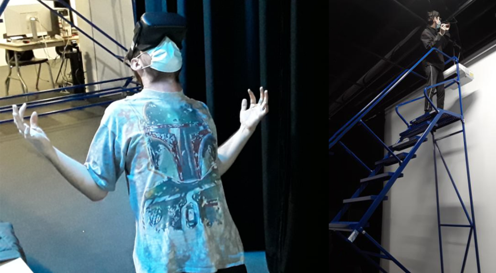
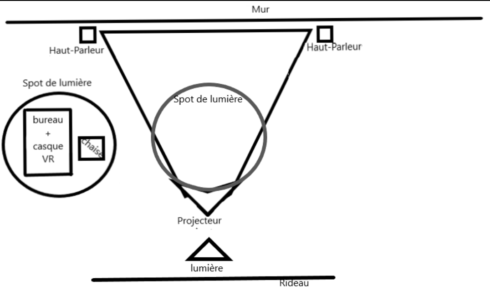

# Titre : 
## Distorsion collective

# Les créateurs et créatrices : 
## William Dubois et Ghislain Lacombe

# La façon dont le thème du temps est exploité dans la création :
## on se retrouve dans une boucle temporelle de cours en ligne avec des travaux qui s'accumulent.

# L'ambiance :
## on se retrouve dans la vie d'une personne qui commence les cours en ligne dans sa chambre et sa maison. Plus que le temps s'écoule plus que l'on ressent l'anxiété de la personne à travers de l'ambiance qui devient de plus en plus angoissante.

# L'installation en cours dans les studios :
## un casque de Vr et un projecteur qui affiche sur le mur une discussion.

# Le schéma de l'installation prévue :

# Ce qui sera attendu de vous, en tant qu'interacteur.trice, lorsque vous ferez l'expérience de l'installation :
## regarder tous les éléments autour et se plonger dans l'univers du jeune homme en regardant la vidéo projetée au mur et ce qui est projeté dans le casque Vr.

# 3 cours du programme qui vous semblent incontournables pour avoir les compétences pour créer ce projet :
## Modélisation 3D pour faire l'espace à l'intérieur du casque Vr. Réalité virtuelle pour faire fonctionner le casque Vr. Gestion de projets multimédias pour gérer le projet.

