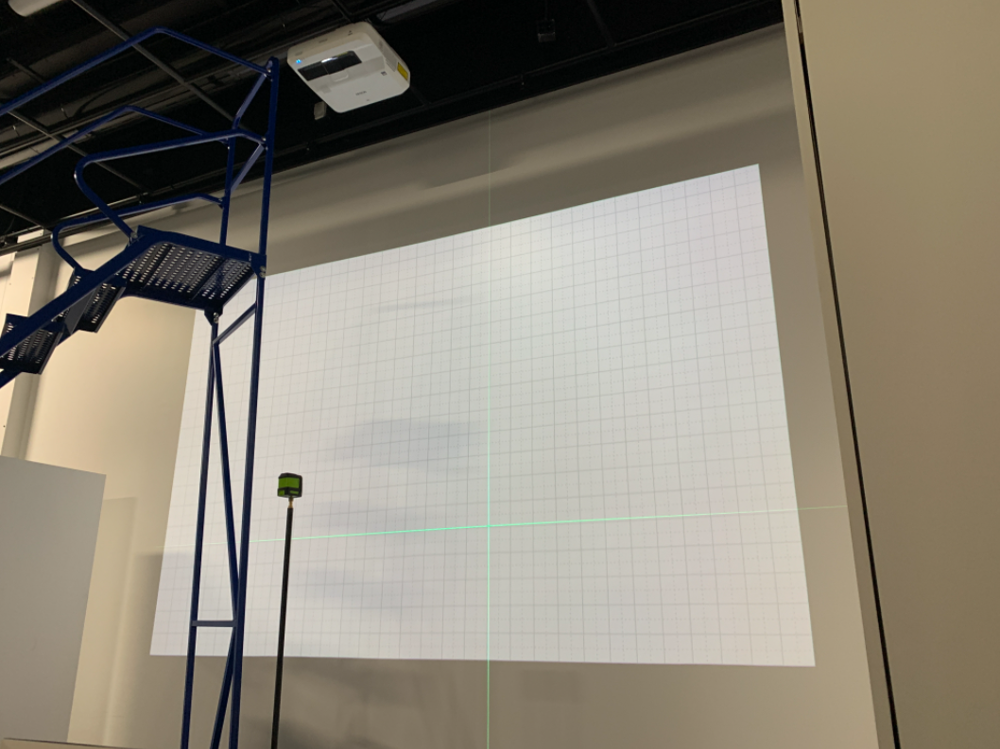

# Titre : 
## Jeu temporel

# Les créateurs et créatrices : 
## Raphaël Fillion et Philippe Trudel

# La façon dont le thème du temps est exploité dans la création :
## le thème du temps est exploiter en montrant comment nos actions vont impacter notre futur par la réponse de questions dans le jeu.

# L'ambiance :
## Une ambiance de jeu téléviser avec beaucoup de couleurs avec de la musique pour montrer l'ambiance de jeu pour ensuite passer vèrs des glitchs avec l'animateur qui devient plus direct envers l'interacteur. À la fin, deux fin sont possibles: une normal ou une fin sombre.

# L'installation en cours dans les studios :
## un interface de questionnaire avec un projecteur qui affiche le jeu

# Le schéma de l'installation prévue :

# Ce qui sera attendu de vous, en tant qu'interacteur.trice, lorsque vous ferez l'expérience de l'installation :
## répondre à 15 questions avec quatre boutons pour choisir la réponse que l'on croit vrai.

# 3 cours du programme qui vous semblent incontournables pour avoir les compétences pour créer ce projet :

