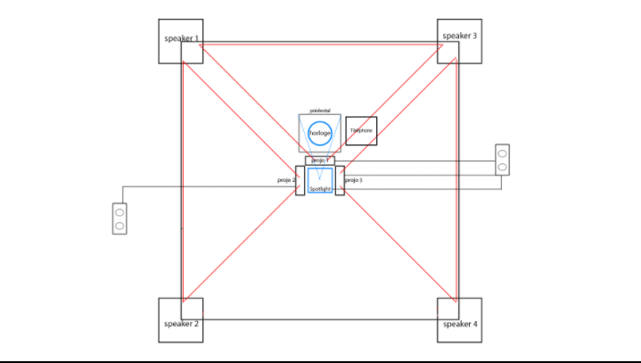

# Titre : 
## L'horloge de l'apocalypse

# Les créateurs et créatrices : 
## Maxime Sabourin, Louis-Philippe Gravel, Alexis Lacasse, Tristan Girard-Montpetit et Maxime De Falco

# La façon dont le thème du temps est exploité dans la création :

## La façon dont le thème du temps sera exploiter sera avec une horloge. Chaque fois que l'aiguille va changer d'heure, les projecteurs vont afficher une période du temps différentes.

# L'ambiance :

## L'ambiance va varier durant l'expérience, elle va passer d'une ambiance calme jusqu'à la fin de l'expérience qui va être une ambiance stressnte et qui va mettre de la pression sur l'intéracteur. 

# L'installation en cours dans les studios :
## Il va y avoir 3 projecteurs qui vont afficher les différentes périodes du temps. Au milieu de la pièce il y a l'horloge qui permet de changer de période et le téléphone sur un piédestal.

# Le schéma de l'installation prévue :

https://tim-montmorency.com/2022/projets/L-horloge-de-l-apocalypse/docs/web/index.html

# Ce qui sera attendu de vous, en tant qu'interacteur.trice, lorsque vous ferez l'expérience de l'installation :
Nous allons entrer dans une salle. Lorsque que nous entrons une kinect situer au plafond déclenchera une lumière. Nous allons nous dirigervers un piédestal sur lequel sera poser une horloge. Chaque fois que nous allons avancer l'heure sur l'horloge,les projecteurs situer au plafond vont projeter des périodes du temps différentes. À la fin de l'expérience, un son de téléphone sera entendu.Lorsque nous intéragirons avec celui-ci, une caméra projetera une vidéode nous dans la pièce créant une atmosphètede pression et de stress. 

# 3 cours du programme qui vous semblent incontournables pour avoir les compétences pour créer ce projet :

## Conception sonore pour la musique de chaque période du temps.
## Conception sonore interactive pour le téléphone qui sonne à la fin de l'expérience.
## Espace interactif pour l'horloge qui change la période du temps selon l'heure.

