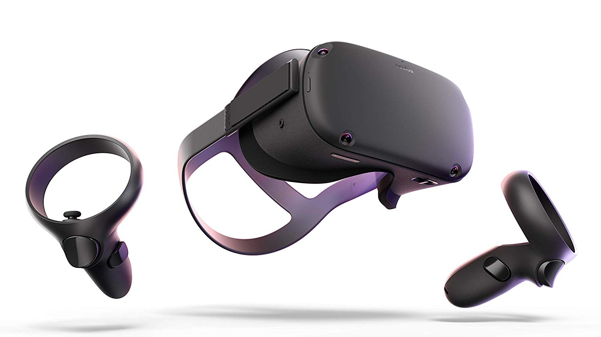

# La technique que nous ne connaissions pas est la Réalité virtuelle. Le casque de réalité virtuelle est un petit écran qui se pose sur le nez et qui couvre tout le haut du visage. Ce casque te permet de te rendre dans un univers immersif, car il affiche des images 3D dans un champ de vision pouvant aller jusqu'à 360° pour donner l'impression d'être en relief. Le casque de Vr est généralement brancher, mais il y a de plus en plus de casque qui deviennent sans fils. Souvent, le casque Vr s'utilise avec des manettes, ces-dernières nous permettent d'intéragir avec l'environnement 3D et nous permettent de nous déplacer. 

